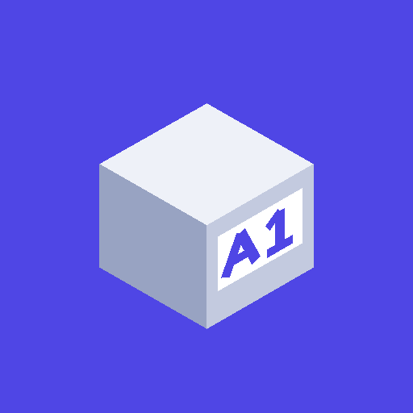

# Cajas Etiquetadas

**Apunta qué hay en cada caja y encuéntralo sin abrirlas.**

Inventario para el trastero, el garaje, el altillo y las mudanzas.
Funciona sin internet · Sin cuentas · Sin anuncios · 2 MB

[Política de privacidad](legal/privacidad.md) ·
[Condiciones de uso](legal/terminos.md) ·
[Licencias](legal/licencias-terceros.md)

---

## El problema

Tienes cajas apiladas en el trastero y no te acuerdas de en cuál está el taladro.
Abres tres, no aparece, y las vuelves a apilar. Con la mudanza igual: cierras
veinte cajas y a la semana no sabes en cuál va el cargador del portátil.

## Cómo se resuelve

Pones un código a cada caja —**A1**, **C3**, el que quieras—, apuntas lo que metes
dentro, y luego lo buscas. La aplicación te dice la caja exacta.

Para escribir hay **una sola barra**, que entiende la frase y decide sola si estás
buscando o guardando:

| Escribes | Pasa |
|---|---|
| `taladro` | te dice en qué caja está |
| `prismaticos` | lo encuentra aunque lo tengas guardado con tilde |
| `destornilladr` | lo encuentra con la errata |
| `C3` | abre esa caja |
| `guardar en C3 tornillos y cinta` | los mete en C3 |

También puedes dictarlo con el micrófono del teclado, que va bien cuando tienes las
manos ocupadas.

## Qué hace

- **Buscador que perdona erratas** y al que no hacen falta tildes. Está pensado para
  escribir con una mano, de pie, en un trastero.
- **Mapa de tus zonas**, con un color por zona y el estado de cada caja: libre, con
  hueco o llena. De un vistazo sabes dónde te cabe algo.
- **Etiquetas QR imprimibles**, del tamaño en centímetros que elijas, con vista previa
  del folio completo e impresión directa. También en versión de solo código, para
  quien no quiera usar QR.
- **Escáner** de esas etiquetas. Y como el QR lleva un enlace, funciona hasta con la
  cámara normal del teléfono: enfocas la caja y se abre en su ficha.
- **Sacar cosas temporalmente** sin borrarlas, con la cuenta de cuánto llevan fuera.
  Para el destornillador que cogiste «un momento» hace tres semanas.
- **Excel** para leer e imprimir, y **copia de seguridad** para cambiar de móvil. Al
  importar puedes **combinar** en vez de sustituir, así que una copia antigua no se
  lleva por delante lo que has hecho desde entonces.
- **Historial de los últimos cambios**, para volver atrás si borras algo sin querer.
- **Tema claro y oscuro.**

## Privacidad: no es una promesa, es una comprobación

**La aplicación no declara el permiso de internet.** Sin ese permiso Android no le
deja abrir ninguna conexión, así que no puede enviar nada a ningún sitio ni aunque el
código lo intentara. Puedes verlo tú mismo en la ficha de Google Play, en el apartado
de permisos.

Sin cuentas, sin anuncios, sin analítica y sin servidores. El único permiso que pide
es la **cámara**, y solo mientras tienes abierto el escáner de códigos.

→ [Política de privacidad completa](legal/privacidad.md)

## Requisitos

Android 7.0 o posterior. Ocupa unos 2 MB.

## Preguntas frecuentes

**¿Necesito imprimir etiquetas con QR?**
No. Puedes rotular las cajas con un rotulador y escribir el código en el buscador. El
QR solo ahorra teclear.

**¿Funciona sin cobertura, en un trastero o un sótano?**
Sí, entero. No hay ninguna función que necesite conexión.

**¿Y si cambio de móvil?**
Exportas una copia de seguridad desde Ajustes y la importas en el nuevo. También la
copia automática de Android puede restaurarla sola.

**¿Cuántas cajas aguanta?**
No hay límite fijado. Está probada con más de mil objetos y responde al instante,
porque la búsqueda va en memoria.

**¿Sirve para una mudanza y no solo para un trastero?**
Sí, y es uno de los casos donde más se nota: numeras las cajas al cerrarlas y al
llegar sabes qué hay en cada una sin abrir ninguna.

## Sobre este repositorio

Aquí viven la web y los documentos legales. **El código fuente es privado.**

## Contacto

Dudas, fallos y sugerencias, en las [incidencias de este
repositorio](https://github.com/yonaesp/cajas-etiquetadas/issues).

---

Hecho en España · Sin anuncios, sin compras y sin recoger datos

